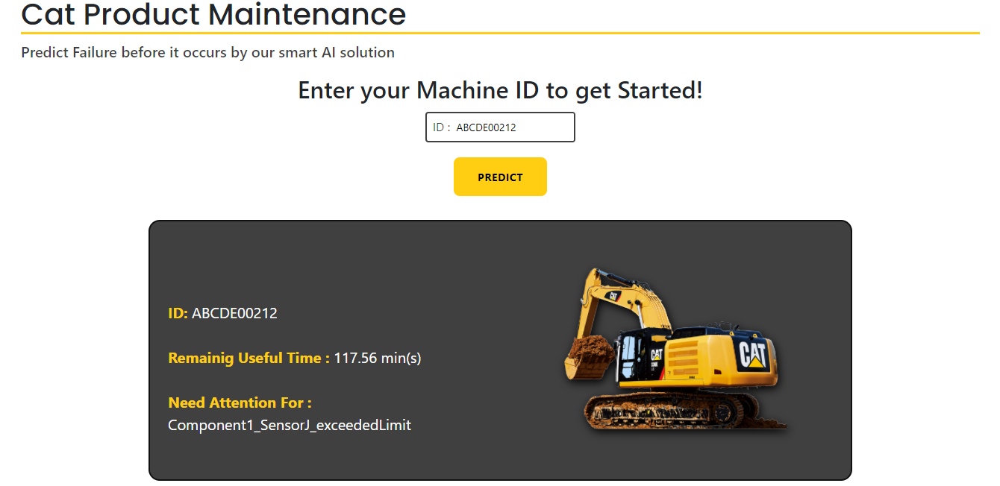

# CAT-A-THON-Project
## Data Mining Project Using Telematics Data to Predict Engine Failures
### Of course... This project WON....!!!




## Usage Instructions
1. Clone the repo
2. Install dependencies
    ```
    pip install pandas scikit-learn openpyxl fastapi uvicorn[standard] aiofiles
    ```
3. Start the server:
    ```
    uvicorn server:app --reload
    ```
    (Wait for few minutes till the server is started and you get an info "Application startup complete")
4. Browse to http://127.0.0.1:8000/public/index.html
